# Personal Portfolio
webiste link:
https://elegant-johnson-3583d3.netlify.com

github link: 
https://github.com/cryptokitties0327/portfolio2

# Preface
This portfolio website is the first HTML & CSS project done for the Coder Academy Fast Track Bootcamp. I had a lot of fun when I tried building the website.

My goal is to continue working my portfolio long term and showcase my progress to everyone.

## Contents
- Planning
- Design
- Final Product
- Challenges
- Other Consideration(key events in the development of the internet from the 1980s to today, domains, web servers, DNS)

---

### Purpose
From the beginning, what I really focused first was the colors. I wanted to have a design that is simple and clean. The functionality of my website includes introductory page, contact page and my resume.

From the development, I managed to understand the fundamental web development process.

I would like to connect with all the like-minded people in the future.

My plan for the website is to continually improve my websites and showcase my progress to people in the tech industry.

## Planning
I have strictly adhered to the timeline and manged to complete the main functionality of the webpage. 

### Trello
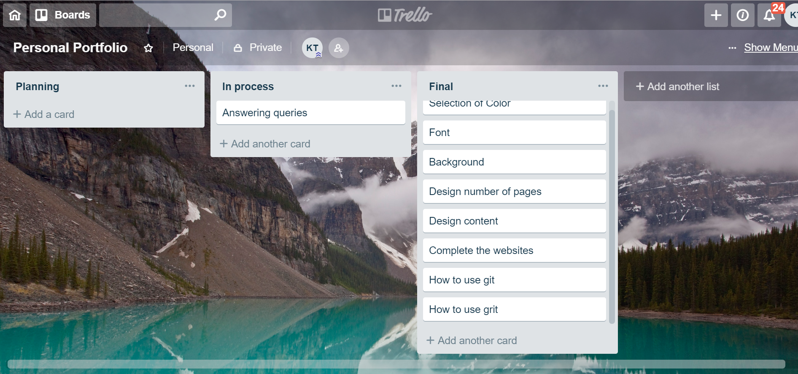

## Design
###Moodboard
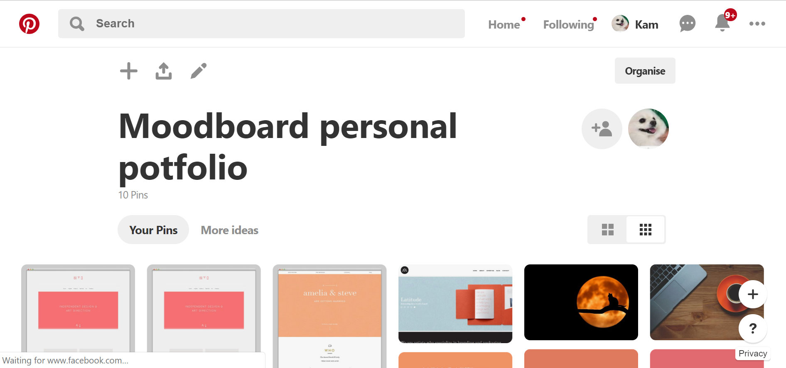
### Wireframe & Scheme
I have done all my planning on Figma.

https://www.figma.com/file/IoPrcDC88KMBq1PUOSgnRuRH/Untitled?node-id=4%3A9

Initially, my design was based on a photo. 

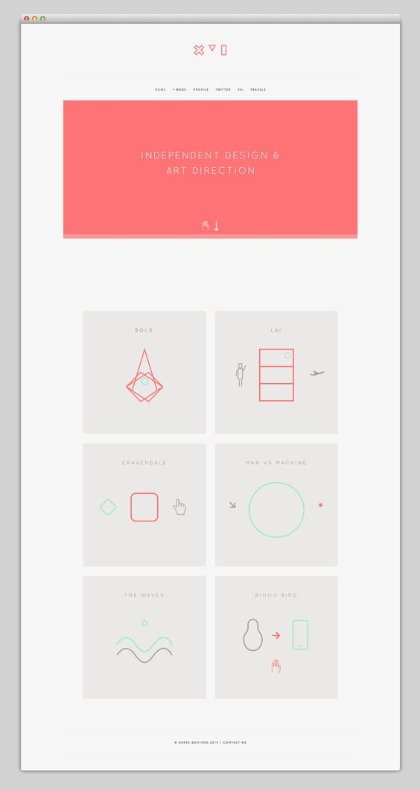

Since I want to make my design more personalised, I have decided to pick the colors from the photos I like instead of merely using a photo as the background.

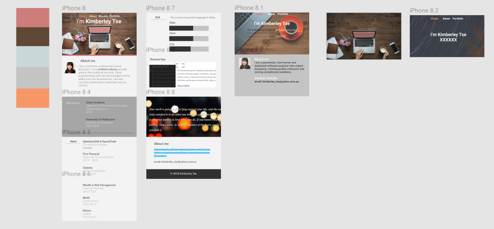
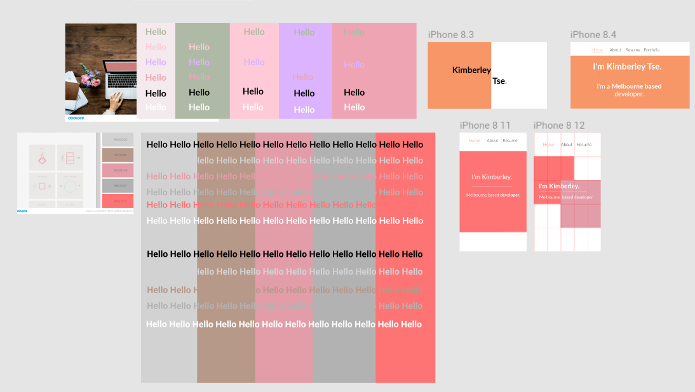
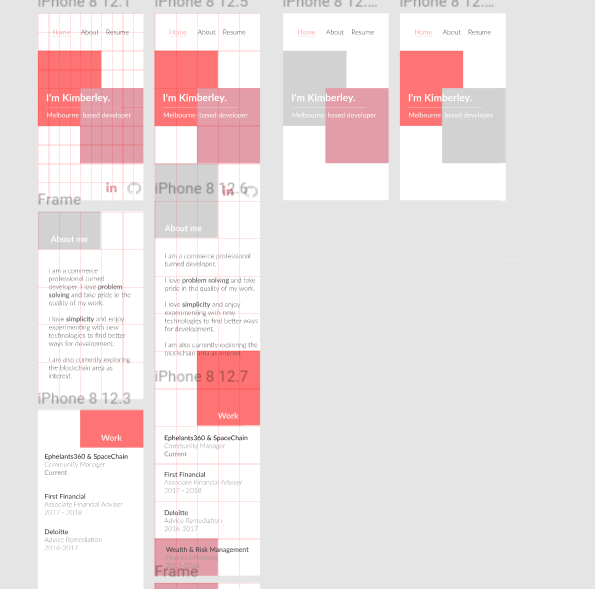
### Colors

The following are my color selection,
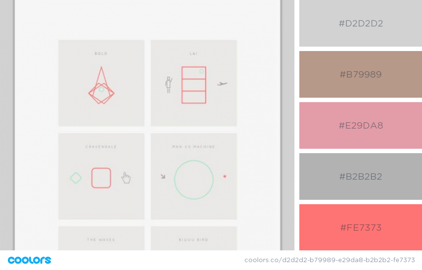
I believe that bright colours are well-matched with my personality, but there has been an issue of colour mix due to readability. 

### Font
I have chosen Lato as it is a clean and clear font.

## Challenges
- Debudding
- Learning how to use grid effectively

## Final Product
My final mobile product.
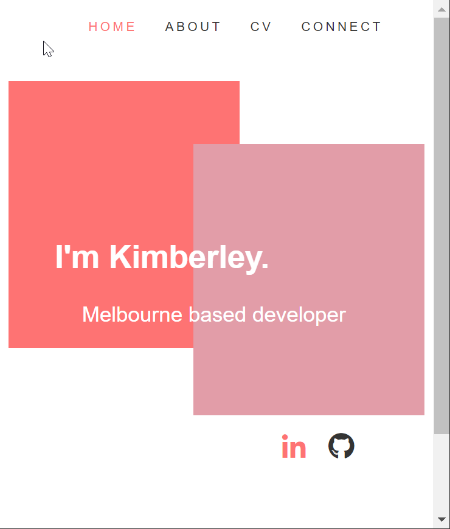
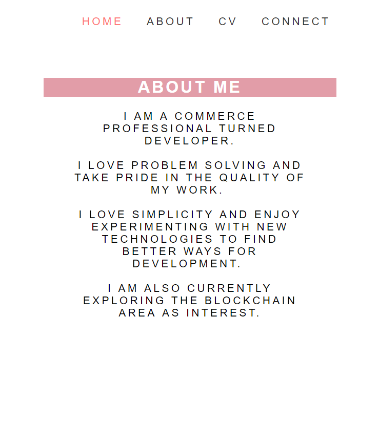
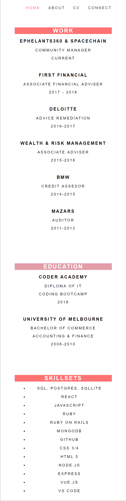
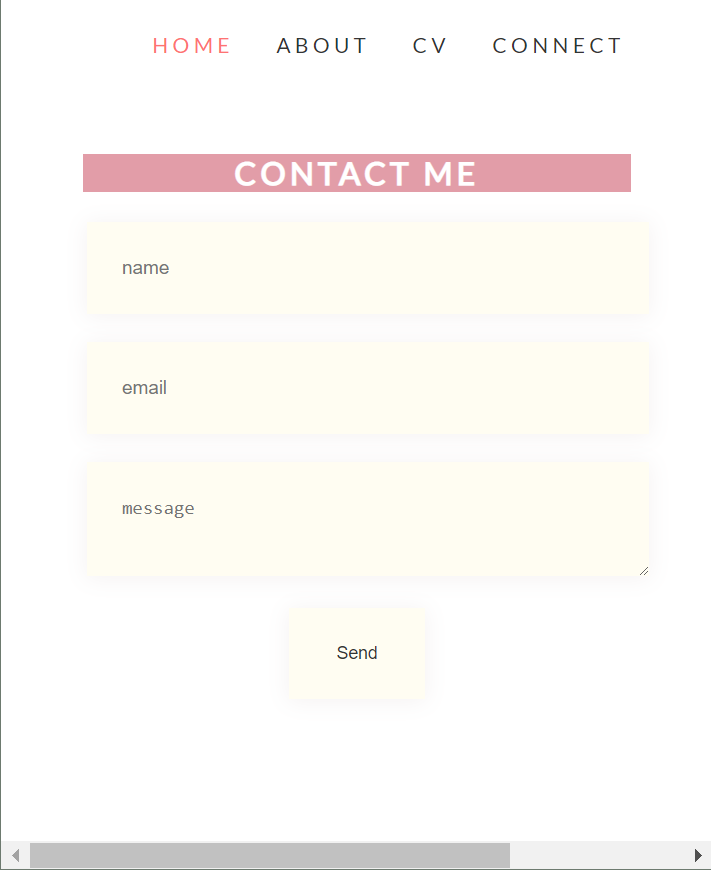

## Other Considertaion
### The development of the internet from the 1980s to today
### Internet history timeline
Early research and development:
- 1980: Ethernet standard introduced
- 1981: BITNET established
Merging the networks and creating the Internet:
- 1981: Computer Science Network (CSNET)
- 1990: GOSIP (without TCP/IP)
- 1995: New Internet architecture with 
- 2000: Dot-com bubble bursts
- 2010: First internationalized country code top-level domains registered
- 2016: ICANN contract with U.S. Dept. of Commerce ends, IANA oversight passes to the global Internet community on October 1st

### Fundamental aspects : domains, web servers, DNS, and web browsers

- Internet connection: Allows you to send and receive data on the web. It's basically like the street between your house and the shop.
- TCP/IP: Transmission Control Protocol and Internet Protocol are communication protocols that define how data should travel across the web. This is like the transport mechanisms that let you place an order, go to the shop, and buy your goods. In our example, this is like a car or a bike (or however else you might get around).
- DNS: Domain Name Servers are like an address book for websites. When you type a web address in your browser, the browser looks at the DNS to find the web site's real address before it can retrieve the website. The browser needs to find out which server the website lives on, so it can send HTTP messages to the right place . This is like looking up the address of the shop so you can access it.
- HTTP: Hypertext Transfer Protocol is an application protocol that defines a language for clients and servers to speak to each other. This is like the language you use to order your goods.
Component files: A website is made up of many different files, which are like the different parts of the goods you buy from the shop. These files come in two main types:
- Code files: Websites are built primarily from HTML, CSS, and JavaScript. 

### The development of internet technologies and how it has contributed to the world today

- The development of internet has changed the world. Online store has disrupted the retail industry. We’re also seeing digital continue to influence changes in the way consumers shop:

- Visits to retail websites via mobile devices overtook desktop traffic for the first time.
- 
- In the US, Europe and Australia, online shopping continues to grow at a much faster rate than retail generally.